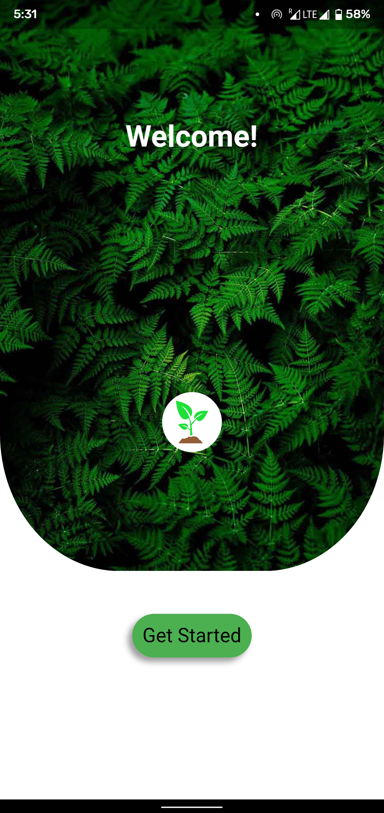
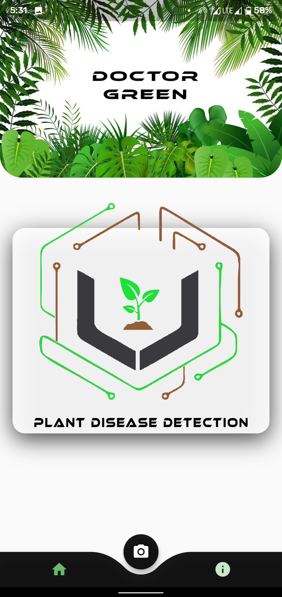
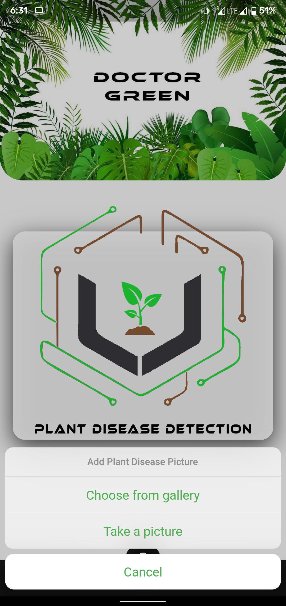
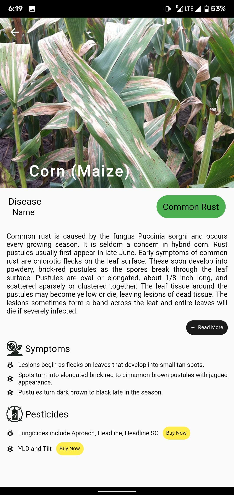
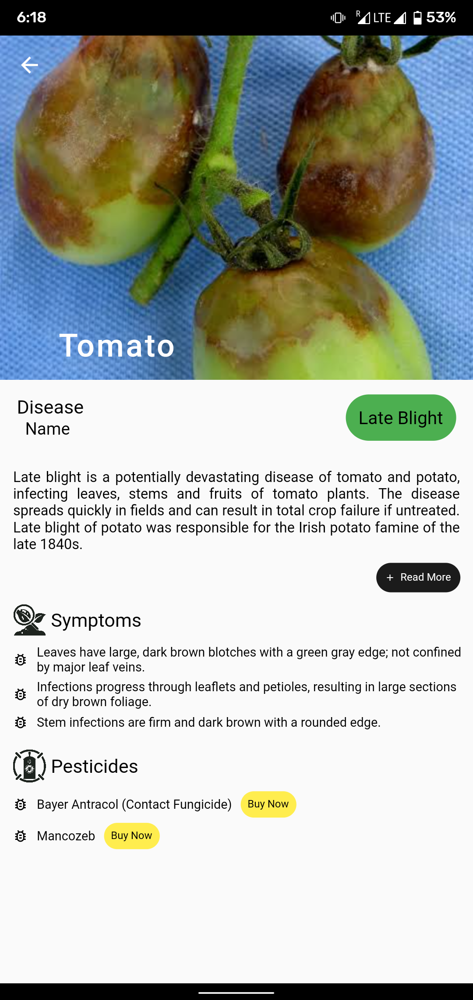
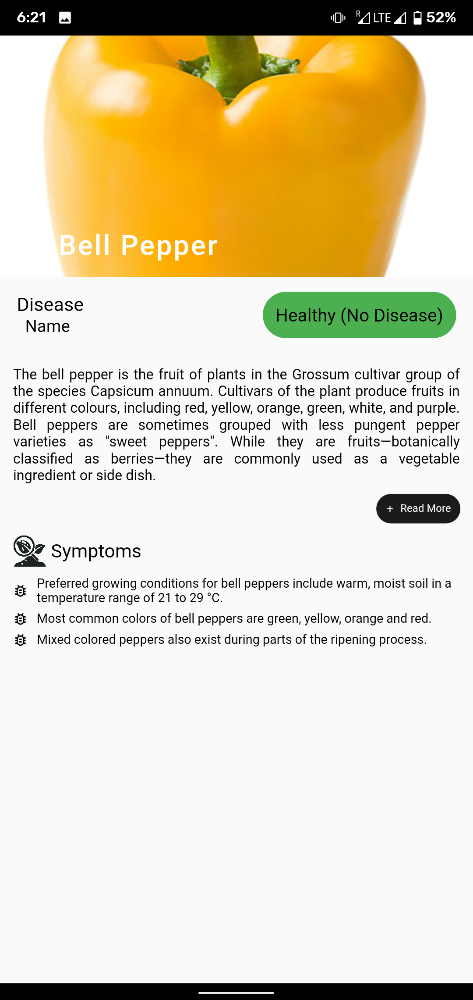
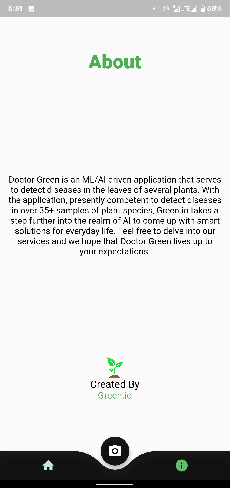

# Dr. Green - Plant Disease Detection Android App

## About the Application:
Doctor Green is an **ML/AI-driven application** that serves to detect diseases in the leaves of several plants. With the application, presently competent to detect diseases in over 35+ samples of plant species.

## View Demo:
https://youtu.be/Y6ZOWMh1No4

## Screenshots:
</a>
</a>
</a>
</a>
</a>
</a>
</a>
